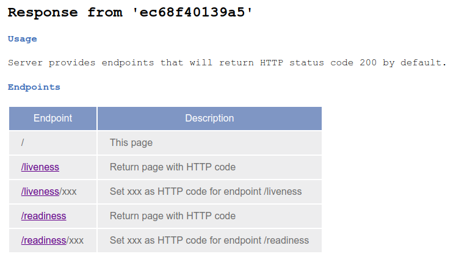

# Abstract
```k8s-test-microservice``` is a nodejs server
packed in a Docker container that provides endpoints
to play around with Kubernetes features. By default each endpoint
returns a 200 HTTP code. That can be changed by setting a path variable
with the desired return code.

This service is already available at Docker Hub.

[rilleralle/k8s-test-microservice](https://hub.docker.com/r/rilleralle/k8s-test-microservice/)

| Endpoint       | Description                                  |
|----------------|----------------------------------------------|
| /              | Shows the hostname with a small description  |
| /liveness      | Return page with HTTP code                   |
| /liveness/xxx  | Set xxx as HTTP code for endpoint /liveness  |
| /readiness     | Return page with HTTP code                   |
| /readiness/xxx | Set xxx as HTTP code for endpoint /readiness |

# What can I do with it?
Kubernetes is a great tool for container orchestration and it is very popular.
However, I realized that a lot of people do not really understand how
powerful a microservice architecture can be in real live, even for tech people.
You can use this service for demonstration purposes.

## Show scaling
As you know, you can create multiple pods that can be accessed via one service.
Deploy ```k8s-test-microservice``` and access the service and you will see
that the response was send by different pods because you can see the hostname
of the answering pod.

## Show self healing
As you know, Kubernetes can check the status of a pod via accessing
the endpoint ```/liveness```. If the HTTP response code is 200 everything
is fine. But if the response is 400 Kubernetes will restart the pod.
By default the HTTP code for endpoint ```/liveness``` is 200. You can change
the code by calling endpoint ```/liveness/400``` for example. From now on
the HTTP status will be 400.


