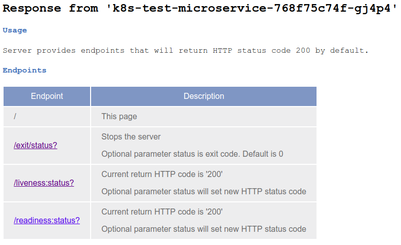

# Abstract
`k8s-test-microservice` is a nodejs server
packed in a Docker container that shows the hostname and provides endpoints
to play around with Kubernetes features. The default port is 3000.
By default `k8s-test-microservice` provides two endpoints with HTTP code 200.
*
That can be changed by setting a path variable with the desired return code.

This service is already available at Docker Hub as `x86_64` and `arm64`.
* [rilleralle/k8s-test-microservice](https://hub.docker.com/r/rilleralle/k8s-test-microservice/)
* [rilleralle/k8s-test-microservice-arm64](https://hub.docker.com/r/rilleralle/k8s-test-microservice-arm64/)

## Start container with default endpoints
```bash
docker run -p 3000:3000 rilleralle/k8s-test-microservice
```

## Start container with individual endpoints
Define your own endpoints via environment variable `ENDPOINTS`

Pattern "endpoint1:defaultHttpCode1,endpoint2:defaultHttpCode2"
```bash
$ docker run -p 3000:3000 -e ENDPOINTS="foo:200,bar:250,baz:400" rilleralle/k8s-test-microservice
```

| Endpoint           | Description                                                                               |
|--------------------|-------------------------------------------------------------------------------------------|
| /                  | This page                                                                                 |
| /name              | Returns the hostname as plain text                                                           |
| /exit/status?      | Stops the server<br>Optional parameter status is exit code. Default is 0                     |
| /liveness:status?  | Current return HTTP code is '200'<br>Optional parameter status will set new HTTP status code |
| /readiness:status? | Current return HTTP code is '200'<br>Optional parameter status will set new HTTP status code |
|                    |                                                                                           |

# What can I do with it?
Kubernetes is a great tool for container orchestration and it is very popular.
However, I realized that a lot of people do not really understand how
powerful a microservice architecture can be in real life, even for tech people.
You can use this service for demonstration purposes.

## Show scaling
1. As you know, you can create multiple pods that can be accessed via one service.
Deploy `k8s-test-microservice` and access the service and you will see
that the response was sent by different pods because you can see the hostname
of the answering pod.

2. Change the number of desired pods via:
  ```
  $ kubectl scale --replicas=10 deployment/k8s-test-microservice
  ```
  Or:
  ```
  Open k8s.yaml file and change under spec replicas the desired number, save the file
  and apply the changes.

  $ kubectl apply -f k8s.yaml
  ```

## Show self-healing
### Liveness
As you know, Kubernetes can check the status of a pod via accessing
a `/liveness` endpoint. If the HTTP response code is 200 everything
is fine. But if the response is 400 Kubernetes will restart the container in the pod.
By default, the HTTP code for endpoint `/liveness` is 200. You can change
the code by calling endpoint `/liveness/400` for example. From now on
the HTTP status will be 400.

### Readiness
Call the endpoint `/readiness/400` and demonstrate that the pod
will not be called until the readiness endpoint will return
a HTTP code between 200 - 399. One way to do this is to open a shell
of the not scheduled and call the `/readiness/200` endpoint.
```
First, remember the name of the pod that is now returning HTTP code 400. E.g. k8s-test-microservice-84d9d8b95f-sdd66

$ kubectl exec -it k8s-test-microservice-84d9d8b95f-sdd66 /bin/sh
$ curl localhost:3000/readiness/200
```
After that you can check that the pod is in ready state again.

### Stop the server
Use the `/kill` endpoint to kill the node server.
You can check, that the pods is still there and the container was restarted.

## Updates
Show how easy it is to deploy a new version without any downtime.
By default image `rilleralle/k8s-test-microservice-arm64:v1` will be
deployed if you execute the `k8s.yaml` or `k8s-arm64.yaml`.
A 'new' version is also available tagged as v2. Update to version v2.
Here are two options:
```
Change the version number in the yaml file and apply the changes.

$ kubectl apply -f k8s.yaml
```
Or:
```
$ kubectl set image deployment/k8s-test-microservice k8s-test-microservice-container=rilleralle/k8s-test-microservice:v2
```
## Rollback update
If you realize that your new version has a bug or the new feature is crap,
you can easily rollback to the latest version.
```
$ kubectl rollout undo deployment/k8s-test-microservice
```